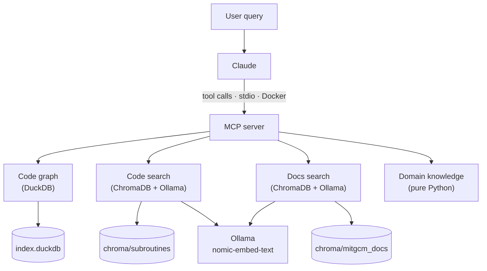

# MITgcm MCP

An MCP server that gives Claude Code live access to the MITgcm source code
graph, documentation, and a domain knowledge layer for rotating-tank
experiments. Ask questions in natural language; the tools retrieve answers
directly from the indexed source and docs.

## Install

Requires [Claude Code](https://claude.ai/code) and Docker.

```bash
claude mcp add --transport stdio --scope user mitgcm -- \
  docker run --rm -i ghcr.io/willirath/mitgcm-mcp:v2026.02.1
```

Docker pulls the image on first use (~600 MB — includes Ollama, the embedding
model, and pre-built indices).

## What it does

Fifteen tools across three layers:

**Code navigation** — search subroutines semantically, read source with
pagination, walk caller/callee graphs, trace namelist parameters and
diagnostics fields to their source, query CPP flags.

**Documentation search** — semantic search over the MITgcm RST documentation
(parameter descriptions, package tutorials, algorithm explanations).

**Domain knowledge** — translate physical lab parameters to namelist values,
compute dimensionless numbers and flag CFL/Ekman issues, look up known
configuration gotchas, get skeleton configs for rotating-convection and
baroclinic-instability experiments.

## Example

```
User: How does MITgcm handle MPI processes?

Claude: MPI topology is set up at boot time. Let me trace
        the initialization path.

→ search_docs_tool("MPI parallel processing decomposition")
  ["Machine model parallelism", "Tiles",
   "Specifying a domain decomposition", ...]

→ find_subroutines_tool("INI_PROCS")
  [{"name": "INI_PROCS", "file": "eesupp/src/ini_procs.F", ...}]

→ get_source_tool("EEBOOT_MINIMAL", limit=80)
  [MPI_Init → MPI_Cart_create with nPx × nPy topology ...]

→ get_source_tool("INI_PROCS", limit=100)
  [MPI_Cart_coords per rank, MPI_Cart_rank for neighbour discovery ...]

Claude: The decomposition is entirely compile-time: SIZE.h sets nPx,
        nPy, nSx, nSy. The number of MPI ranks launched must equal
        nPx × nPy — there is no runtime check until the model aborts.
```

## Architecture



## Docs

| File | Covers |
|---|---|
| [`docs/mcp-server.md`](docs/mcp-server.md) | MCP server, all tools, integration |
| [`docs/tools.md`](docs/tools.md) | Query tool functions and return shapes |
| [`docs/domain-knowledge.md`](docs/domain-knowledge.md) | Domain knowledge layer |
| [`docs/runtime.md`](docs/runtime.md) | MITgcm Docker runtime, experiments |
| [`docs/release.md`](docs/release.md) | Release process (build, push, tag, publish) |
| [`docs/duckdb.md`](docs/duckdb.md) | Code graph schema, example queries |
| [`docs/chromadb.md`](docs/chromadb.md) | Embedding pipeline, chunking |
| [`docs/docs-index.md`](docs/docs-index.md) | RST documentation index |
| [`docs/parsing.md`](docs/parsing.md) | Fortran extraction approach |
| [`docs/diagrams.md`](docs/diagrams.md) | Pipeline and query-time flow diagrams |

## Milestones

| Milestone | What | Status |
|---|---|---|
| M0 | Environment, MITgcm submodule, embeddings server | ✓ |
| M1 | DuckDB code graph (2433 subroutines indexed) | ✓ |
| M2 | ChromaDB subroutine index | ✓ |
| M3 | Core query tools | ✓ |
| M4 | MCP server | ✓ |
| M5 | Domain knowledge layer | ✓ |
| M6 | MITgcm runtime environment (Docker) | ✓ |
| M7 | First real experiment (rotating convection) | ✓ |
| M8 | MITgcm documentation index | ✓ |

## For developers

Requires [pixi](https://pixi.sh) and Docker.

```bash
git clone --recurse-submodules https://github.com/willirath/2026_mitgcm_mcp
cd 2026_mitgcm_mcp
pixi install

# Start the Ollama embedding server
docker compose up -d
docker compose exec ollama ollama pull nomic-embed-text   # first time only

# Build the indices
pixi run index       # Fortran → DuckDB (~2 min)
pixi run embed       # subroutines → ChromaDB (~45 min)
pixi run embed-docs  # RST docs → ChromaDB (~5 min)

# Run tests
pixi run test

# Start the MCP server (Claude Code launches this automatically via .mcp.json)
pixi run serve
```

## Layout

```
.
├── src/
│   ├── indexer/       Fortran source parser → DuckDB
│   ├── embedder/      Subroutine embedding pipeline → ChromaDB
│   ├── docs_indexer/  RST documentation parser + embedding pipeline
│   ├── domain/        Domain knowledge (scales, gotchas, configs)
│   ├── tools.py       Plain Python callables over DuckDB + ChromaDB
│   └── server.py      FastMCP stdio server
├── tests/
├── experiments/
│   ├── rotating_convection/   Worked example (README + gen.py + plot.py)
│   └── tutorial_rotating_tank/
├── docker/
│   ├── mitgcm/        MITgcm build image (gfortran + MPICH + NetCDF)
│   └── mcp/           Self-contained MCP image (Ollama + model + indices)
├── scripts/           Build and run helpers for experiments
├── docs/              Implementation notes (one file per component)
├── plans/             Design docs and release roadmap
├── MITgcm/            MITgcm source (git submodule, pinned @ decd05a — checkpoint69k)
├── compose.yml        Ollama service for development
├── .mcp.json          Claude Code MCP server config (points to GHCR image)
└── data/              Generated artifacts — gitignored (index.duckdb, chroma/)
```

