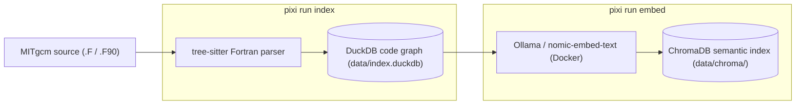
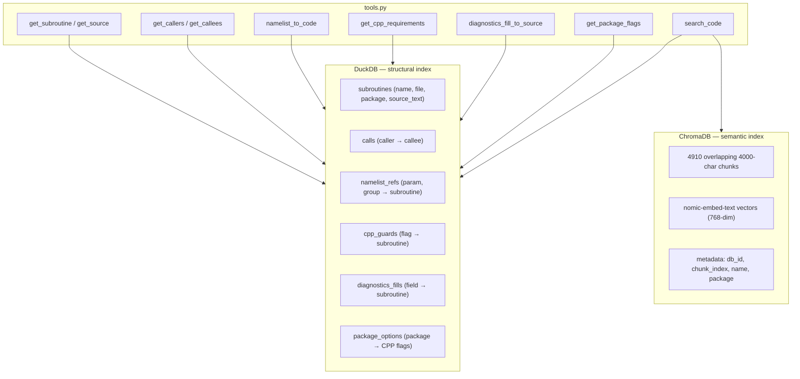
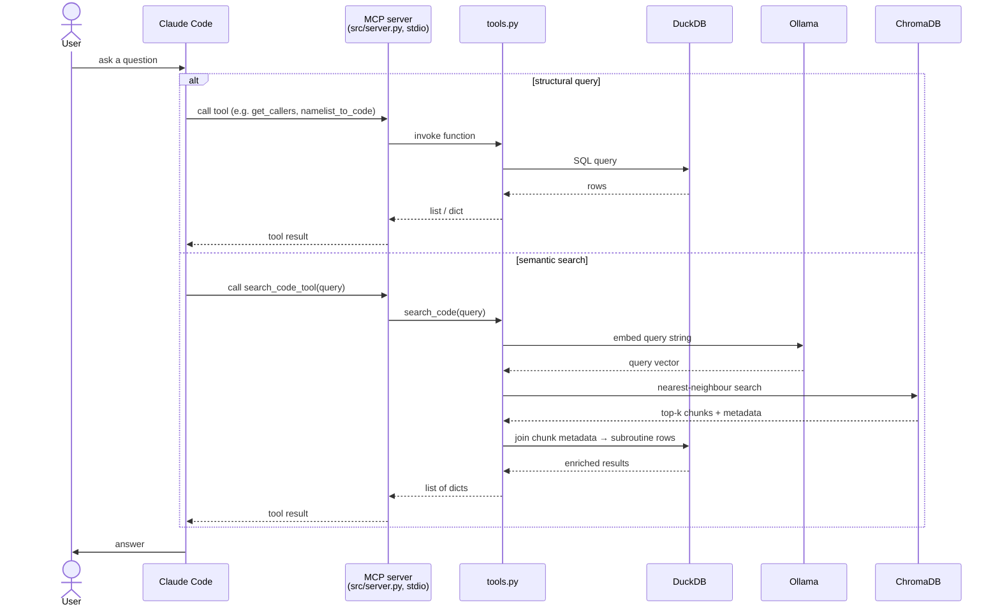

# System diagrams

## Build pipeline

How MITgcm Fortran source is transformed into the two queryable indices.

The DuckDB code graph stores structural relationships: subroutines, call
edges, namelist references, CPP guards, and diagnostics fills. The ChromaDB
index stores vector embeddings of overlapping 4000-character chunks of each
subroutine's source, enabling natural-language search.

---

## Database roles

What each index stores and which tools query it.

`search_code` queries ChromaDB for the nearest-neighbour chunks, then joins
back to DuckDB on `db_id` to return full subroutine metadata.

---

## Query-time flow

How a question from a user reaches the indices and returns an answer.

The MCP server is launched automatically by Claude Code as a subprocess when
`.mcp.json` is present. Communication is over stdin/stdout — no network port
is involved.
